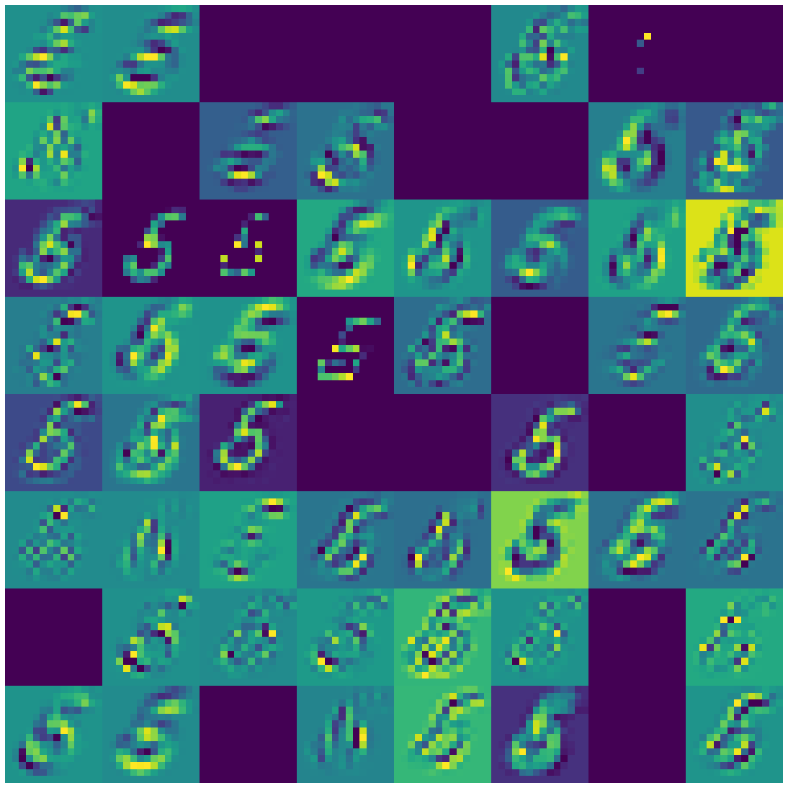
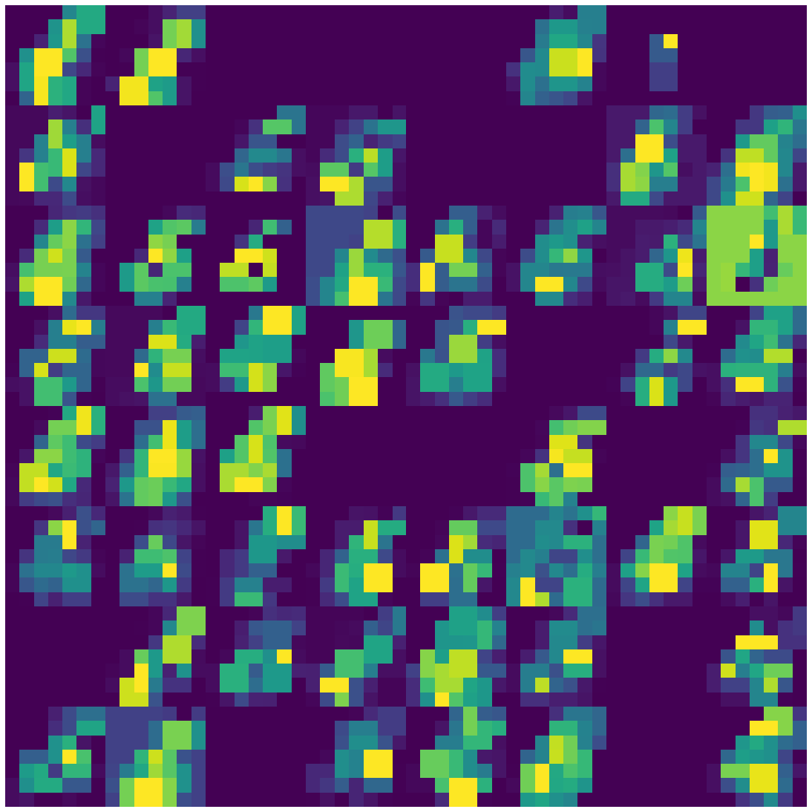

# 	Introduction:

Convolutional Neural Network (CNN) has been dominating in image classification systems since 2012**[1]**, different network architectures, such as VGG**[2]**, ResNet**[3]** and EfficientNet**[4]** etc., have demonstrated its ability to surpass human level performance on visual recognition tasks**[5]**.  
Past Research has unveiled the core reason of such impressive classification performance: CNN is able to extract features from its different layers to create rich embedding information for downstream tasks**[6]**. In this report, we will investigate the visualization of such embeddings in two different datasets, and evaluate these feature embeddings performance on both deep neural network and classic machine learning structures.


# 	Report Outline: 

We first setup a baseline model by taking the mean average of pixels on MNIST dataset, this non-deep learning model provides a foundation block to evaluate machine learning models. We then use ResNet-18 (ImageNet pretrained) and Scattering Net to extract features from MNIST, and finetuning the ResNet-18 model with a customized classification head. We perform T-SNE on both cases, and are focused on analyzing the fine-tuned model feature representations. Finally, we showed that how ResNet-18 convolution layers are capturing a single input image features. In addition, performance of CNN and various regression models are compared. 

To further our understanding, we also pushed both CNN and Scattering Net models on Cifar10 datasets, we explain that Scattering net is under performance on information rich inputs since its convolution filters are predefined. However, pretrained CNN model is more robust to such changes. We also published our code in the reference section and it is available in Github.

# 	Feature Extraction:

## 	Baseline

MNIST has 10 different classes (class 0-9), inspired by the Neural Collapse paper**[7]**, before training, we stacked each classes training samples to form a class mean, and plot the mean pixels shown in Figure 1. We can then calculate the L1 loss between the new input against each of the mean pixels. When evaluating on the validation set (10,000 datapoints), an accuracy of 64.5% is set as a basis for further machine learning model performance.


```python
from fastai import *
from fastai.vision import *

import torch
%matplotlib inline
data = Path('/home/jupyter/hkust/math/data/mnist.pkl.gz')
with gzip.open(data,'rb') as f:
    ((x_train,y_train), (x_valid, y_valid), _) = pickle.load(f,encoding='latin-1')
df = pd.DataFrame(data=x_train)
df['label'] = y_train
means = []
for i in range(10):
    means.append(np.array(df[df['label'] == i].mean()[:-1]))
rows = 5
fig, ax = plt.subplots(rows,2,figsize=(10,6))
#fig.subplots_adjust(hspace=0.0, wspace=0, left=0, right=1, top=1, bottom=0)
idx = 0

for i in range(rows):
    img_1 = means[idx].reshape(28,28)
    ax[i][0].set_title(idx)
    ax[i][0].imshow(img_1,cmap='gray')
    ax[i][0].set_axis_off()
    idx += 1
    
    img_2 = means[idx].reshape(28,28)
    ax[i][1].set_title(idx)
    ax[i][1].set_axis_off()
    ax[i][1].imshow(img_2,cmap='gray')
    idx += 1
```


           Figure 1: Mean of Training Set

##	Experiment setup 

### 	ResNet-18

We are using ImageNet pretrained ResNet-18 model shown in Appendix, final convolution layer is used to extract feature embeddings for MNIST validation set. The model is then added with a specified defined classification head for finetuning. The customized designed included concat-pooling (avg and max pool), two extra linear blocks with Relu**[5]**, BN**[8]** and Dropout**[9]** and cosine annealing is used for fast convergence. During finetuning, the added layer is first trained for 4 epochs and the entire model is trained for 5 epochs. Adam optimizer and discriminative learning rate**[10]** is used.

Features from conv[7],linear[1][3], linear[1][7] and softmax layer is extracted. T-SNE is used to project high dimensional features to 2D for analysis **[Appendix]**. We also plot its original image in thumbnail to further understand feature representation. Finally, a single image is randomly selected and forward passed to the fine-tuned model, each convolutional filter representation is captured and plotted.

### 	Scattering Net

A single 2D scattering net layer is used to extract features from MNIST validation set, the features are then projected to 2D using T-SNE for analysis.

# 4.	Visualization

## ResNet-18

In this section, we first plot T-SNE graph for pretrained ResNet 18 final convolution layer feature extractions from MNIST validation set. After fine-tuning the model, different layers’ feature embeddings are captured from final convolution to output. We have found that when projecting the different layers’ features in 2D, each class have demonstrated a better clustering towards their class mean. In order to further investigate the outliners, we have plotted original thumbnail image to show that most of the outliners are noise in the MNIST, and feature representation learned from CNN models are well separated with a clear margin gap.

Finally, we have tested how each CNN filters are capturing different features. By showing the activation maps in section 4.1.6, we explained that ResNet 18 is overparameterized for MNIST classification task. 

### Final Conv Layer in pretrained ResNet


```python
g = sns.lmplot('x', 'y', data=prob_df, hue='labels', fit_reg=False, legend=False, height=10)
```


                Figure 2: 10K datapoints with its 512 features

### Final Conv Layer after fine-tuning


```python
g = sns.lmplot('x', 'y', data=prob_df, hue='labels', fit_reg=False, legend=False, height=10)
```


                Figure 3: 10K datapoints with its 512 features


```python
prob_df['fname'] = f_names
fig, ax = visualize_scatter_with_images(conv_tsne, prob_df, image_zoom=1, suffix='conv7')
plt.show()
```


                Figure 3.1: Thumbnail mapped to its T-SNE presentation

As we can see, the fine-tuned model is able to have a better clustering distribution than the pretrained verison. In addtion, the outliners in the margin areas are out of order distribution or mislabels. It will be much clear as we moving towards to the output layer

### Linear Layer in Classification head


```python
g = sns.lmplot('x', 'y', data=prob_df, hue='labels', fit_reg=False, legend=False, height=10)
```


                Figure 4: 10K datapoints with its 1024 features


```python
fig, ax = visualize_scatter_with_images(linear_tsne, prob_df, image_zoom=1, suffix='linear_1st_m13')
plt.show()
```


                Figure 4.1: Thumbnail mapped to its T-SNE presentation

### Second Linear Layer in Classification head


```python
prob_df = pd.DataFrame(np.concatenate((linear_tsne, y_vals[:,None]), axis=1), columns=['x','y','labels'])
g = sns.lmplot('x', 'y', data=prob_df, hue='labels', fit_reg=False, legend=False, height=10)
```


                Figure 5: 10K datapoints with its 1024 features


```python
prob_df['fname'] = f_names
fig, ax = visualize_scatter_with_images(linear_tsne, prob_df, image_zoom=1, suffix='linear7')
plt.show()
```


                Figure 5.1: Thumbnail mapped to its T-SNE presentation

### Final Classification head


```python
g = sns.lmplot('x', 'y', data=prob_df, hue='labels', fit_reg=False, legend=False, height=10)
```


                Figure 6: 10K datapoints with its 10 features


```python
fig, ax = visualize_scatter_with_images(probs_trans, prob_df, image_zoom=1, suffix='probabilities')
plt.show()
```


                Figure 6.1: Thumbnail mapped to its T-SNE presentation

In the final classification head, it is clear that it has poor clustering representation. Softmax layer has calculated activations from high dimentions to 10 dimensions, therefore the feature representations lose much of its information, resulting T-SNE has poor projection.

### Activation Map for single input

ResNet 18 has 7 convolutional layers, its filter size is the following: 64, 64, 64, 64, 64, 128, 256, 512. For layers that have more than 64 filters, the first 64 filters are plotted. 
Figure 7 shows the 1st convolution layer 64 filters


```python
[i.features.shape for i in sfs]
```


    [torch.Size([1, 64, 14, 14]),
     torch.Size([1, 64, 14, 14]),
     torch.Size([1, 64, 14, 14]),
     torch.Size([1, 64, 7, 7]),
     torch.Size([1, 64, 7, 7]),
     torch.Size([1, 128, 4, 4]),
     torch.Size([1, 256, 2, 2]),
     torch.Size([1, 512, 1, 1])]


```python
activs = sfs[0].features.detach().cpu().numpy()[0]
fig, axes = plt.subplots(8,8, figsize=(15,15))
fig.subplots_adjust(hspace=0.0, wspace=0, left=0, right=1, top=1, bottom=0)
for i, ax in enumerate(axes.flat):
    ax.imshow(activs[i])
    ax.set_axis_off()
```


                Figure 7: 1st convolution layer 64 filters


```python
activs = sfs[1].features.detach().cpu().numpy()[0]
fig, axes = plt.subplots(8,8, figsize=(15,15))
fig.subplots_adjust(hspace=0.0, wspace=0, left=0, right=1, top=1, bottom=0)
for i, ax in enumerate(axes.flat):
    ax.imshow(activs[i])
    ax.set_axis_off()
```





                Figure 8: 2nd convolution layer 64 filters


```python
activs = sfs[2].features.detach().cpu().numpy()[0]
fig, axes = plt.subplots(8,8, figsize=(15,15))
fig.subplots_adjust(hspace=0.0, wspace=0, left=0, right=1, top=1, bottom=0)
for i, ax in enumerate(axes.flat):
    ax.imshow(activs[i])
    ax.set_axis_off()
```


                Figure 9: 3rd convolution layer 64 filters


```python
activs = sfs[3].features.detach().cpu().numpy()[0]
fig, axes = plt.subplots(8,8, figsize=(15,15))
fig.subplots_adjust(hspace=0.0, wspace=0, left=0, right=1, top=1, bottom=0)
for i, ax in enumerate(axes.flat):
    ax.imshow(activs[i])
    ax.set_axis_off()
```





                Figure 10: 4th convolution layer 64 filters


```python
activs = sfs[4].features.detach().cpu().numpy()[0]
fig, axes = plt.subplots(8,8, figsize=(15,15))
fig.subplots_adjust(hspace=0.0, wspace=0, left=0, right=1, top=1, bottom=0)
for i, ax in enumerate(axes.flat):
    ax.imshow(activs[i])
    ax.set_axis_off()
```


                Figure 11: 5th convolution layer 64 filters


```python
activs = sfs[5].features.detach().cpu().numpy()[0]
fig, axes = plt.subplots(8,8, figsize=(15,15))
fig.subplots_adjust(hspace=0.0, wspace=0, left=0, right=1, top=1, bottom=0)
for i, ax in enumerate(axes.flat):
    ax.imshow(activs[i])
    ax.set_axis_off()

```


                Figure 12: 6th convolution layer with first 64 filters


```python
activs = sfs[6].features.detach().cpu().numpy()[0]
fig, axes = plt.subplots(8,8, figsize=(15,15))
fig.subplots_adjust(hspace=0.0, wspace=0, left=0, right=1, top=1, bottom=0)
for i, ax in enumerate(axes.flat):
    ax.imshow(activs[i])
    ax.set_axis_off()
```


                Figure 13: 7th convolution layer with first 64 filters


```python
activs = sfs[7].features.detach().cpu().numpy()[0]
fig, axes = plt.subplots(8,8, figsize=(15,15))
fig.subplots_adjust(hspace=0.0, wspace=0, left=0, right=1, top=1, bottom=0)
for i, ax in enumerate(axes.flat):
    ax.imshow(activs[i])
    ax.set_axis_off()
```


                Figure 14: 8th convolution layer with first 64 filters

As we can see from the above plots, the digit 5 has distilled in the later convolution layers. We argue that the reason for such effect is because MNIST doesn't have rich information presented in its features, and high level convolution filters are designed to capture high level feature representations. Thus, no related information are detected in the high level filters, its plot is therefore blank.

## 	Scattering Net feature representation


```python
g = sns.lmplot('x', 'y', data=prob_df, hue='labels', fit_reg=False, legend=False, height=10)
```


                Figure 15: 10K datapoints with its 3096 features

The single layer scattering net has produced impressive clustering feature embeddings. The pre-designed filters are working well on extracting lower level features. 

# Evaluation

In this section, we first report accuracy of different machine learning models, such as ResNet18, Regression and Random Forest against baseline non machine learning model. We have shown that CNN models are performing best in different metrics. We then calculated its various status based on the project-1 requirements.

# Cifar 10

Since MNIST is single channel and doesn’t contain rich information, we therefore rerun the test on Cifar10 dataset. The final convolution layer features and activation maps are plotted. We noticed a degradation of performance of scattering net, where CNN are still robust and able to capture more features.


```python
g = sns.lmplot('x', 'y', data=prob_df, hue='labels', fit_reg=False, legend=False, height=10)
```


                Figure 16: Scattering net, 3200 datapoints with its 3096 features


```python
g = sns.lmplot('x', 'y', data=prob_df, hue='labels', fit_reg=False, legend=False, height=10)
```


                 Figure 17: ResNet-18, 3200 datapoints with its 512 features

Both Scattering Net and Pretrained ResNet-18 is unable to seperate the data at this stage since CIFAR-10 dataset contains more information than MNIST dataset


```python

```

# Conclusion


```python

```


```python

```


```python

```


```python

```

# Citation

[1] A. Krizhevshy et.al, 2016, Image Net Classification with Deep Convolutional Neural Networks https://papers.nips.cc/paper/4824-imagenet-classification-with-deep-convolutional-neural-networks.pdf

[2] K. Simonyan & A. Zisserman, 2015, Very Deep Convolutional Networks for Large-Scale Image Recognition
https://arxiv.org/abs/1409.1556

[3] K. He et.al, 2015, Deep Residual Learning for Image Recognition
https://arxiv.org/abs/1512.03385

[4] M. Tan et.al, 2019, EfficientNet: Rethinking Model Scaling for Convolutional Neural Networks
https://arxiv.org/abs/1905.11946

[5] K. He et.al, 2015, Delving Deep into Rectifiers: Surpassing Human-level Performance on ImageNet Classification
https://arxiv.org/abs/1502.01852

[6] M.D. Zeiler & R. Fergus, 2013, Visualizing and Understanding Convolutional Networks
https://arxiv.org/pdf/1311.2901.pdf

[7] V. Papyan et.al, 2020, Prevalence of Neural Collapse during the terminal phase of deep learning training
https://arxiv.org/abs/2008.08186

[8] S. Ioffe & C. Szegedy, 2015, Batch Normalization: Accelerating Deep Network Training By Reducing Internal Covariate Shift
https://arxiv.org/abs/1502.03167

[9] N. Srivastava et.al, 2014, Dropout: a simple way to prevent neural networks from overfitting
https://dl.acm.org/doi/10.5555/2627435.2670313

[10] J. Howard & S. Ruder, 2018, Universal Language Model Fine-tuning for Text Classification
https://arxiv.org/abs/1801.06146


```python

```


```python

```

# Code Reference


```python
%reload_ext autoreload
%autoreload 2
%matplotlib inline
```


```python
from fastai import *
from fastai.vision import *
```


```python
from sklearn.manifold import TSNE
import seaborn as sns
from sklearn import manifold, datasets
from sklearn.metrics.pairwise import pairwise_distances
from sklearn.metrics import confusion_matrix
from scipy.spatial.distance import squareform
from matplotlib.offsetbox import OffsetImage, AnnotationBbox
from matplotlib.ticker import NullFormatter
import PIL

from kymatio.torch import Scattering2D
```


```python
path = untar_data(URLs.MNIST,dest='/home/jupyter/hkust/math/data')
path.ls()
```


    [PosixPath('/home/jupyter/hkust/math/data/mnist_png/testing'),
     PosixPath('/home/jupyter/hkust/math/data/mnist_png/training'),
     PosixPath('/home/jupyter/hkust/math/data/mnist_png/models')]


**Getting Scattering Net features**


```python
scattering = Scattering2D(shape = (28, 28), J=2)
data = (ImageList.from_folder(path=path,convert_mode='L')
                .split_by_folder(train='training',valid='testing')
                .label_from_folder()
                .databunch(bs=128))
```


```python
sfs = []
targ = []
for x,y in data.valid_dl:
    p = scattering(x)
    sfs.append(p.detach().numpy())
    targ.append(y)
```


```python
sfs_cat = np.concatenate(sfs)
sfs_cat.shape
```


    (10000, 1, 81, 7, 7)


```python
sfs_cat = sfs_cat.reshape(10000,-1)
sfs_cat.shape
```


    (10000, 3969)


```python
probs_trans = manifold.TSNE(n_components=2, perplexity=15).fit_transform(sfs_cat)
```


```python
y = np.concatenate(targ)
y.shape
```


    (10000,)


```python
prob_df = pd.DataFrame(np.concatenate((probs_trans, y[:,None]), axis=1), columns=['x','y','labels'])
```

**Getting ResNet-18 Features**


```python
data = ImageDataBunch.from_folder(path=path,train='training',valid='testing',bs=128).normalize(imagenet_stats)
```


```python
data.show_batch(rows=4,figsize=(10,6))
```


```python
data.train_ds[0]
```


    (Image (3, 28, 28), Category 1)


```python
data.train_ds[0][0]
```


```python
data.train_ds
```


    LabelList (60000 items)
    x: ImageList
    Image (3, 28, 28),Image (3, 28, 28),Image (3, 28, 28),Image (3, 28, 28),Image (3, 28, 28)
    y: CategoryList
    1,1,1,1,1
    Path: /home/jupyter/hkust/math/data/mnist_png


```python
learn = cnn_learner(data,models.resnet18,metrics=error_rate).to_fp16()
```

**Customized head and model index labels**


```python
learn.model
```


    Sequential(
      (0): Sequential(
        (0): Conv2d(3, 64, kernel_size=(7, 7), stride=(2, 2), padding=(3, 3), bias=False)
        (1): BatchNorm2d(64, eps=1e-05, momentum=0.1, affine=True, track_running_stats=True)
        (2): ReLU(inplace=True)
        (3): MaxPool2d(kernel_size=3, stride=2, padding=1, dilation=1, ceil_mode=False)
        (4): Sequential(
          (0): BasicBlock(
            (conv1): Conv2d(64, 64, kernel_size=(3, 3), stride=(1, 1), padding=(1, 1), bias=False)
            (bn1): BatchNorm2d(64, eps=1e-05, momentum=0.1, affine=True, track_running_stats=True)
            (relu): ReLU(inplace=True)
            (conv2): Conv2d(64, 64, kernel_size=(3, 3), stride=(1, 1), padding=(1, 1), bias=False)
            (bn2): BatchNorm2d(64, eps=1e-05, momentum=0.1, affine=True, track_running_stats=True)
          )
          (1): BasicBlock(
            (conv1): Conv2d(64, 64, kernel_size=(3, 3), stride=(1, 1), padding=(1, 1), bias=False)
            (bn1): BatchNorm2d(64, eps=1e-05, momentum=0.1, affine=True, track_running_stats=True)
            (relu): ReLU(inplace=True)
            (conv2): Conv2d(64, 64, kernel_size=(3, 3), stride=(1, 1), padding=(1, 1), bias=False)
            (bn2): BatchNorm2d(64, eps=1e-05, momentum=0.1, affine=True, track_running_stats=True)
          )
        )
        (5): Sequential(
          (0): BasicBlock(
            (conv1): Conv2d(64, 128, kernel_size=(3, 3), stride=(2, 2), padding=(1, 1), bias=False)
            (bn1): BatchNorm2d(128, eps=1e-05, momentum=0.1, affine=True, track_running_stats=True)
            (relu): ReLU(inplace=True)
            (conv2): Conv2d(128, 128, kernel_size=(3, 3), stride=(1, 1), padding=(1, 1), bias=False)
            (bn2): BatchNorm2d(128, eps=1e-05, momentum=0.1, affine=True, track_running_stats=True)
            (downsample): Sequential(
              (0): Conv2d(64, 128, kernel_size=(1, 1), stride=(2, 2), bias=False)
              (1): BatchNorm2d(128, eps=1e-05, momentum=0.1, affine=True, track_running_stats=True)
            )
          )
          (1): BasicBlock(
            (conv1): Conv2d(128, 128, kernel_size=(3, 3), stride=(1, 1), padding=(1, 1), bias=False)
            (bn1): BatchNorm2d(128, eps=1e-05, momentum=0.1, affine=True, track_running_stats=True)
            (relu): ReLU(inplace=True)
            (conv2): Conv2d(128, 128, kernel_size=(3, 3), stride=(1, 1), padding=(1, 1), bias=False)
            (bn2): BatchNorm2d(128, eps=1e-05, momentum=0.1, affine=True, track_running_stats=True)
          )
        )
        (6): Sequential(
          (0): BasicBlock(
            (conv1): Conv2d(128, 256, kernel_size=(3, 3), stride=(2, 2), padding=(1, 1), bias=False)
            (bn1): BatchNorm2d(256, eps=1e-05, momentum=0.1, affine=True, track_running_stats=True)
            (relu): ReLU(inplace=True)
            (conv2): Conv2d(256, 256, kernel_size=(3, 3), stride=(1, 1), padding=(1, 1), bias=False)
            (bn2): BatchNorm2d(256, eps=1e-05, momentum=0.1, affine=True, track_running_stats=True)
            (downsample): Sequential(
              (0): Conv2d(128, 256, kernel_size=(1, 1), stride=(2, 2), bias=False)
              (1): BatchNorm2d(256, eps=1e-05, momentum=0.1, affine=True, track_running_stats=True)
            )
          )
          (1): BasicBlock(
            (conv1): Conv2d(256, 256, kernel_size=(3, 3), stride=(1, 1), padding=(1, 1), bias=False)
            (bn1): BatchNorm2d(256, eps=1e-05, momentum=0.1, affine=True, track_running_stats=True)
            (relu): ReLU(inplace=True)
            (conv2): Conv2d(256, 256, kernel_size=(3, 3), stride=(1, 1), padding=(1, 1), bias=False)
            (bn2): BatchNorm2d(256, eps=1e-05, momentum=0.1, affine=True, track_running_stats=True)
          )
        )
        (7): Sequential(
          (0): BasicBlock(
            (conv1): Conv2d(256, 512, kernel_size=(3, 3), stride=(2, 2), padding=(1, 1), bias=False)
            (bn1): BatchNorm2d(512, eps=1e-05, momentum=0.1, affine=True, track_running_stats=True)
            (relu): ReLU(inplace=True)
            (conv2): Conv2d(512, 512, kernel_size=(3, 3), stride=(1, 1), padding=(1, 1), bias=False)
            (bn2): BatchNorm2d(512, eps=1e-05, momentum=0.1, affine=True, track_running_stats=True)
            (downsample): Sequential(
              (0): Conv2d(256, 512, kernel_size=(1, 1), stride=(2, 2), bias=False)
              (1): BatchNorm2d(512, eps=1e-05, momentum=0.1, affine=True, track_running_stats=True)
            )
          )
          (1): BasicBlock(
            (conv1): Conv2d(512, 512, kernel_size=(3, 3), stride=(1, 1), padding=(1, 1), bias=False)
            (bn1): BatchNorm2d(512, eps=1e-05, momentum=0.1, affine=True, track_running_stats=True)
            (relu): ReLU(inplace=True)
            (conv2): Conv2d(512, 512, kernel_size=(3, 3), stride=(1, 1), padding=(1, 1), bias=False)
            (bn2): BatchNorm2d(512, eps=1e-05, momentum=0.1, affine=True, track_running_stats=True)
          )
        )
      )
      (1): Sequential(
        (0): AdaptiveConcatPool2d(
          (ap): AdaptiveAvgPool2d(output_size=1)
          (mp): AdaptiveMaxPool2d(output_size=1)
        )
        (1): Flatten()
        (2): BatchNorm1d(1024, eps=1e-05, momentum=0.1, affine=True, track_running_stats=True)
        (3): Dropout(p=0.25, inplace=False)
        (4): Linear(in_features=1024, out_features=512, bias=True)
        (5): ReLU(inplace=True)
        (6): BatchNorm1d(512, eps=1e-05, momentum=0.1, affine=True, track_running_stats=True)
        (7): Dropout(p=0.5, inplace=False)
        (8): Linear(in_features=512, out_features=10, bias=True)
      )
    )


```python
learn.fit_one_cycle(4)
```


<table border="1" class="dataframe">
  <thead>
    <tr style="text-align: left;">
      <th>epoch</th>
      <th>train_loss</th>
      <th>valid_loss</th>
      <th>error_rate</th>
      <th>time</th>
    </tr>
  </thead>
  <tbody>
    <tr>
      <td>0</td>
      <td>0.740019</td>
      <td>0.483432</td>
      <td>0.156500</td>
      <td>04:06</td>
    </tr>
    <tr>
      <td>1</td>
      <td>0.354149</td>
      <td>0.214774</td>
      <td>0.067900</td>
      <td>00:33</td>
    </tr>
    <tr>
      <td>2</td>
      <td>0.219526</td>
      <td>0.148823</td>
      <td>0.047400</td>
      <td>00:33</td>
    </tr>
    <tr>
      <td>3</td>
      <td>0.172455</td>
      <td>0.134206</td>
      <td>0.043000</td>
      <td>00:33</td>
    </tr>
  </tbody>
</table>


```python
learn.recorder.plot_lr()
```


                Figure: Cosine Scheduler


```python
learn.recorder.plot_losses()
```


                Figure: 1st stage training


```python
learn.unfreeze()
learn.fit_one_cycle(5, max_lr=slice(1e-6,1e-4))
```


<table border="1" class="dataframe">
  <thead>
    <tr style="text-align: left;">
      <th>epoch</th>
      <th>train_loss</th>
      <th>valid_loss</th>
      <th>error_rate</th>
      <th>time</th>
    </tr>
  </thead>
  <tbody>
    <tr>
      <td>0</td>
      <td>0.141263</td>
      <td>0.114553</td>
      <td>0.036600</td>
      <td>00:36</td>
    </tr>
    <tr>
      <td>1</td>
      <td>0.106294</td>
      <td>0.084589</td>
      <td>0.027800</td>
      <td>00:36</td>
    </tr>
    <tr>
      <td>2</td>
      <td>0.075915</td>
      <td>0.071318</td>
      <td>0.023100</td>
      <td>00:36</td>
    </tr>
    <tr>
      <td>3</td>
      <td>0.068376</td>
      <td>0.067394</td>
      <td>0.020800</td>
      <td>00:36</td>
    </tr>
    <tr>
      <td>4</td>
      <td>0.057121</td>
      <td>0.065715</td>
      <td>0.020500</td>
      <td>00:36</td>
    </tr>
  </tbody>
</table>


```python
learn.save('/home/jupyter/hkust/math/model/mnist_res18')
```


```python
learn.load('/home/jupyter/hkust/math/model/mnist_res18');
```


```python
interp = ClassificationInterpretation.from_learner(learn)
```


```python
interp.plot_top_losses(9, figsize=(15,11))
```


```python
preds = interp.preds
y = interp.y_true
```


```python
preds.shape
```


    torch.Size([10000, 10])


# Getting embeddings 


```python
out_df = pd.DataFrame(preds.numpy())
```


```python
out_df['label'] = y.numpy()
```


```python
out_df.to_csv('/home/jupyter/hkust/math/data/final_pred.csv',index=False)
```

# Result from prediction


```python
probs_trans = manifold.TSNE(n_components=2, perplexity=15).fit_transform(preds)
```


```python
prob_df = pd.DataFrame(np.concatenate((probs_trans, y[:,None]), axis=1), columns=['x','y','labels'])
```


```python
prob_df.head()
```


<div>
<style scoped>
    .dataframe tbody tr th:only-of-type {
        vertical-align: middle;
    }

    .dataframe tbody tr th {
        vertical-align: top;
    }

    .dataframe thead th {
        text-align: right;
    }
</style>
<table border="1" class="dataframe">
  <thead>
    <tr style="text-align: right;">
      <th></th>
      <th>x</th>
      <th>y</th>
      <th>labels</th>
    </tr>
  </thead>
  <tbody>
    <tr>
      <td>0</td>
      <td>17.869276</td>
      <td>-80.282677</td>
      <td>1.0</td>
    </tr>
    <tr>
      <td>1</td>
      <td>-83.587456</td>
      <td>-54.389988</td>
      <td>1.0</td>
    </tr>
    <tr>
      <td>2</td>
      <td>-11.553489</td>
      <td>-74.869148</td>
      <td>1.0</td>
    </tr>
    <tr>
      <td>3</td>
      <td>-3.845061</td>
      <td>-81.423561</td>
      <td>1.0</td>
    </tr>
    <tr>
      <td>4</td>
      <td>2.773640</td>
      <td>-90.228981</td>
      <td>1.0</td>
    </tr>
  </tbody>
</table>
</div>


```python
prob_df['fname'] = learn.data.valid_ds.x.items
```


```python
def visualize_scatter_with_images(scaled_data, df, figsize=(64,64), image_zoom=1, suffix=1):
    fig, ax = plt.subplots(figsize=figsize)
    artists = []
    xx = scaled_data[:,0]
    yy = scaled_data[:,1]
    
    for i, (x,y) in enumerate(zip(xx,yy)):
        im = PIL.Image.open(df['fname'][i])
        im.thumbnail((64,64))
        img = OffsetImage(im, zoom=image_zoom, cmap='gray')
        ab = AnnotationBbox(img, (x, y), xycoords='data', frameon=False)
        artists.append(ax.add_artist(ab))
    ax.update_datalim(np.column_stack([xx,yy]))
    ax.autoscale()
    
    fig.savefig(f'TSNE_{suffix}.jpg', bbox_inches = 'tight')
    return fig, ax
```

# Taking activation in the middle layers


```python
class SaveFeatures_test():
    features=None
    def __init__(self, m): self.hook = m.register_forward_hook(self.hook_fn)
    def hook_fn(self, module, input, output): self.features = output.detach()
    def remove(self): self.hook.remove()
```


```python
y_vals = learn.data.valid_ds.y.items
f_names = learn.data.valid_ds.x.items
```


```python
def get_activs(l1, l2):
    sfs_lst = []
    m = learn.model.eval()
    sf = SaveFeatures_test(children(m)[l1][l2])
    
    for x,y in learn.data.valid_dl:
        p = m(x)
        sfs_lst.append(to_np(sf.features.cpu().detach()))
        sf.remove
    
    return sfs_lst
```

# Final convolution activations from Res-18


```python
sfs = get_activs(0, 7) # final convolution layer activation
```


```python
sfs_cat = np.concatenate(sfs)
sfs_cat.shape
```


    (10000, 512, 1, 1)


```python
sfs_cat = sfs_cat.reshape((10000, -1))
sfs_cat.shape
```


    (10000, 512)


```python
out_df = pd.DataFrame(sfs_cat)
out_df['label'] = y_vals
out_df.to_csv('/home/jupyter/hkust/math/data/conv7_pretrained.csv',index=False)
```


```python
conv_tsne = manifold.TSNE(n_components=2, perplexity=15).fit_transform(sfs_cat)
```


```python
prob_df = pd.DataFrame(np.concatenate((conv_tsne, y_vals[:,None]), axis=1), columns=['x','y','labels'])
```

# First linear layers in head
should I pull before drop out? currently pulling drop out activations


```python
sfs = get_activs(1, 3)
```


```python
sfs_cat = np.concatenate(sfs)
sfs_cat.shape
```


    (10000, 1024)


```python
out_df = pd.DataFrame(sfs_cat)
out_df['label'] = y_vals
out_df.to_csv('/home/jupyter/hkust/math/data/linear1.csv',index=False)
```


```python
%%time
linear_tsne = manifold.TSNE(n_components=2, perplexity=15).fit_transform(sfs_cat)
```

    CPU times: user 5min 4s, sys: 0 ns, total: 5min 4s
    Wall time: 5min 4s


```python
prob_df = pd.DataFrame(np.concatenate((linear_tsne, y_vals[:,None]), axis=1), columns=['x','y','labels'])
```


```python
prob_df['fname'] = f_names
```

# 2nd Linear layer


```python
sfs = get_activs(1, 7)
sfs_cat = np.concatenate(sfs)
sfs_cat.shape
```


    (10000, 512)


```python
out_df = pd.DataFrame(sfs_cat)
out_df['label'] = y_vals
out_df.to_csv('/home/jupyter/hkust/math/data/linear7.csv',index=False)
```


```python
%%time
linear_tsne = manifold.TSNE(n_components=2, perplexity=15).fit_transform(sfs_cat)
```

    CPU times: user 2min 45s, sys: 0 ns, total: 2min 45s
    Wall time: 2min 45s


# Activations in each conv


```python
PIL.Image.open(learn.data.valid_ds.x.items[4421])
```


```python
learn.to_fp32();
```


```python
m = learn.model.eval()
```


```python
sfs = [SaveFeatures_test(children(m)[0][i]) for i in range(len(children(m)[0]))]
```


```python
x = learn.data.valid_ds.x[4421]
y = learn.data.valid_ds.y[4421]
```


```python
x.data[...][None].shape
```


    torch.Size([1, 3, 28, 28])


```python
p = m(x.data[...][None].cuda())
```

# Cifar 10


```python
path = untar_data(URLs.CIFAR,dest='/home/jupyter/hkust/math/data')
path.ls()
```


    [PosixPath('/home/jupyter/hkust/math/data/cifar10/labels.txt'),
     PosixPath('/home/jupyter/hkust/math/data/cifar10/test'),
     PosixPath('/home/jupyter/hkust/math/data/cifar10/train')]


```python
ImageList.filter_by_folder??
```


```python
data = (ImageList.from_folder(path=path)
                .filter_by_folder(exclude='mnist_png')
                .split_by_folder(train='train',valid='test')
                .label_from_folder()
                .databunch(bs=128))
```


```python
data
```


    ImageDataBunch;
    
    Train: LabelList (50000 items)
    x: ImageList
    Image (3, 32, 32),Image (3, 32, 32),Image (3, 32, 32),Image (3, 32, 32),Image (3, 32, 32)
    y: CategoryList
    bird,bird,bird,bird,bird
    Path: /home/jupyter/hkust/math/data/cifar10;
    
    Valid: LabelList (10000 items)
    x: ImageList
    Image (3, 32, 32),Image (3, 32, 32),Image (3, 32, 32),Image (3, 32, 32),Image (3, 32, 32)
    y: CategoryList
    bird,bird,bird,bird,bird
    Path: /home/jupyter/hkust/math/data/cifar10;
    
    Test: None


```python
scattering = Scattering2D(shape = (32, 32), J=2)
```


```python
test_dl = data.valid_dl.new(shuffle=True)
```


```python
sfs = []
targ = []
for i,(x,y) in enumerate(test_dl):
    if i == 25: # 3200 datapoints
        break
    p = scattering(x)
    sfs.append(p.detach().numpy())
    targ.append(y)
```


```python
sfs_cat = np.concatenate(sfs)
sfs_cat.shape
```


    (3200, 3, 81, 8, 8)


```python
sfs_cat = sfs_cat.reshape(3200,-1)
sfs_cat.shape
```


    (3200, 15552)


```python
%%time
probs_trans = manifold.TSNE(n_components=2, perplexity=15).fit_transform(sfs_cat)
```

    CPU times: user 6min 2s, sys: 396 ms, total: 6min 2s
    Wall time: 6min 2s


```python
y = np.concatenate(targ)
y.shape
```


    (3200,)


```python
prob_df = pd.DataFrame(np.concatenate((probs_trans, y[:,None]), axis=1), columns=['x','y','labels'])
```


```python
learn = cnn_learner(data,models.resnet18,metrics=error_rate)
```


```python
sfs_lst = []
m = learn.model.eval()
sf = SaveFeatures_test(children(m)[0][7])

for i, (x,y) in enumerate(test_dl):
    if i == 25:
        break
    p = m(x)
    sfs_lst.append(to_np(sf.features.cpu().detach()))
    sf.remove
```


```python
sfs_cat = np.concatenate(sfs_lst)
sfs_cat.shape
```


    (3200, 512, 1, 1)


```python
sfs_cat = sfs_cat.reshape(3200,-1)
```


```python
%%time
probs_trans = manifold.TSNE(n_components=2, perplexity=15).fit_transform(sfs_cat)
```

    CPU times: user 36.8 s, sys: 0 ns, total: 36.8 s
    Wall time: 36.8 s


```python
prob_df = pd.DataFrame(np.concatenate((probs_trans, y[:,None]), axis=1), columns=['x','y','labels'])
```


```python

```
